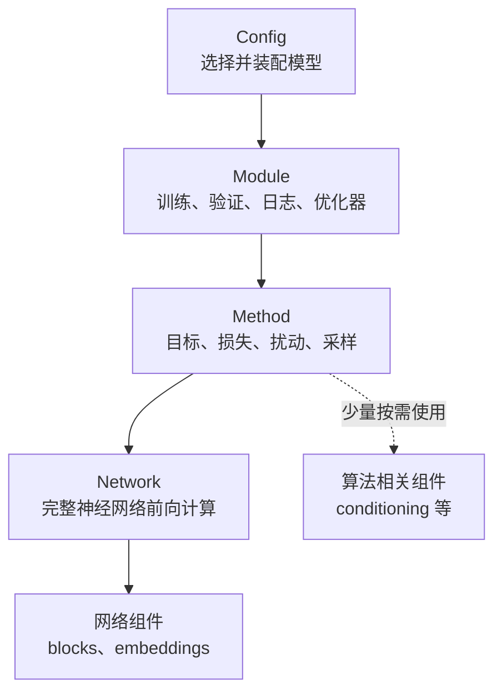
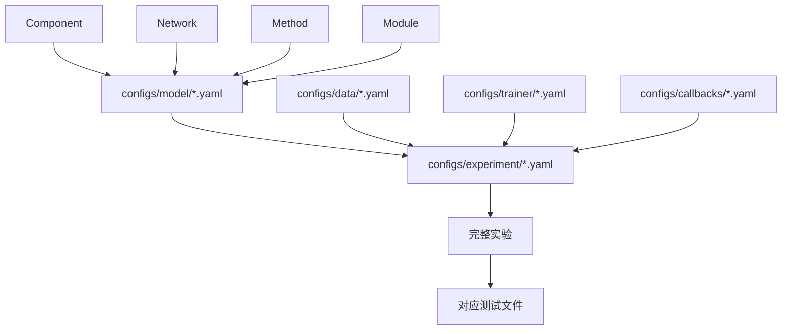
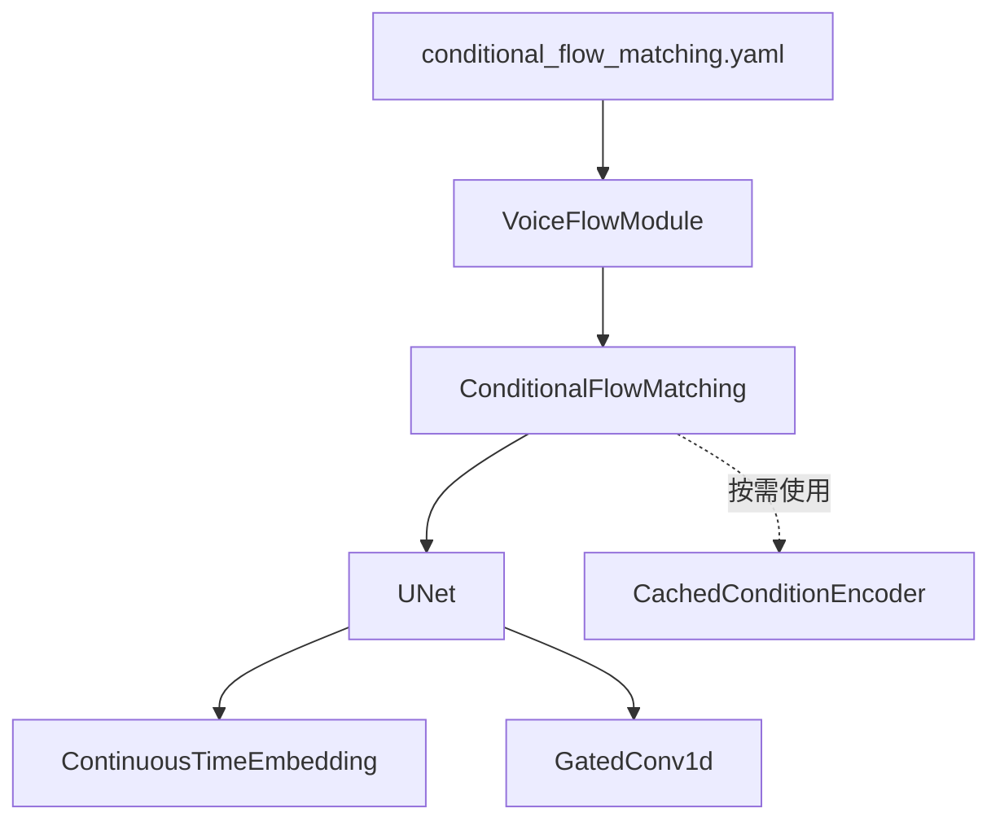

# `src/models` 结构说明

## 目录结构

```text
src/models/
├── components/                # 可复用的小组件
│   ├── blocks/                # 卷积、Transformer、波形处理块
│   ├── conditioning/          # 内容和说话人条件编码
│   └── embeddings/            # 连续时间、离散时间嵌入
├── networks/                  # 独立的完整神经网络
│   ├── dense/                 # 全连接网络家族
│   ├── unet/                  # U-Net 网络家族
│   └── transformer/           # Transformer、DiT 网络家族
├── methods/                   # 算法目标、损失和采样过程
│   ├── discriminative/        # 分类方法
│   ├── representation/        # AE、掩码重构等表征学习
│   └── generative/            # VAE、GAN、扩散、Flow Matching
└── modules/                   # Lightning 生命周期、Batch 适配和优化流程
```

## 依赖关系



主要所有权关系：

```text
Config
└── Module
    └── Method
        ├── 一个或多个 Network
        │   └── 网络组件
        └── 少量算法相关组件（可选）
```

底层不能反向依赖上层：Network 不应依赖 Method 或 Lightning，Component 不应知道具体模型算法。Method 只在条件构造等无法归入 Network 的场景下直接使用少量 Component。

## 各层职责

### `components/`

提供局部、可复用的小组件。时间嵌入、门控卷积和 Transformer Block 主要由 Network 使用；MeanVC 条件编码等算法输入组件可以由 Method 按需使用。PyTorch 已提供的普通层直接使用，不重复封装。

### `networks/`

提供具有明确输入输出契约的完整参数化函数，只负责前向计算。顶层子目录按 Dense、U-Net、Transformer 等主要架构家族划分；目录内文件再表达条件形式、数据形态或复合接口。详细规则见 `src/models/networks/README.md`。

### `methods/`

组织一个或多个 Network，定义如何训练和生成，包括损失、时间或噪声采样、概率路径、扩散过程和 Flow 积分。同一个 Method 可以组合兼容的不同 Network，并仅在必要时持有条件编码等少量 Component。

### `modules/`

持有 Method，负责 Lightning 生命周期、Batch 适配、指标记录、优化器、调度器和检查点兼容。Module 按训练生命周期和 Batch 契约分类，不按 Network 架构或 Method 算法分类；多个 Method 训练流程相同时可以复用同一个 Module。详细规则见 `src/models/modules/README.md`。

## 配置组装与实验测试

`src/models/` 通过分层实现代码解耦，但实际运行时由 Hydra 配置把各层重新组装成完整实验：



- `configs/model/*.yaml` 组装 Module、Method、Network 和 Component，形成完整模型。
- `configs/experiment/*.yaml` 继续选择数据、模型、Trainer 和 Callback，形成可运行实验。
- `tests/models/test_*.py` 不只测试单个类，还应验证该实验对应的 Network、Method 和 Module 能否正确协作。
- 配置测试负责确认 Hydra 可以实例化完整组合，实验测试负责确认损失、梯度、预测和训练生命周期符合预期。

因此，目录分层用于复用和维护，配置负责组合，测试负责验证组合后的实验行为。

## 示例


