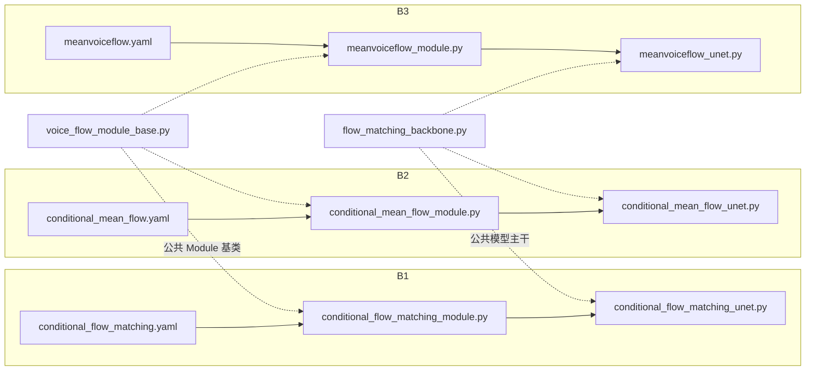

# 论文实验总览

> 更新时间：2026-09-23
> 本文档用于统一记录论文实验设计、受控变量和实验结论。新增实验时按 `B4`、`B5` 等编号继续扩展。

## 1. 实验目标

本组实验研究不同流模型训练目标和推理方式对语音转换性能的影响。目前包含：

- **B1**：条件 Flow Matching 基线；
- **B2**：条件 MeanFlow；
- **B3**：MeanVoiceFlow。

B1、B2、B3 的代码实现彼此独立，不互相继承或导入。它们只复用中立的训练基础设施、条件编码器和 U-Net 主干，以控制非实验变量。

## 2. 公共实验设置

| 项目            | 当前设置                                 |
| --------------- | ---------------------------------------- |
| 数据集          | VCTK                                     |
| 数据划分        | `unseen_speaker_sentence`                |
| 随机种子        | 12345                                    |
| 目标特征        | 80 维 log-Mel                            |
| 内容条件        | FastU2++，256 维离线特征                 |
| 说话人条件      | WavLM Large + ECAPA-TDNN，256 维离线特征 |
| 融合条件        | `CachedConditionEncoder`，输出 128 维    |
| U-Net 隐藏通道  | 512                                      |
| 时间嵌入        | 128 维                                   |
| 卷积核          | 3                                        |
| 默认 batch size | 32                                       |
| 最大 epoch      | 500                                      |
| 梯度裁剪        | 1.0                                      |
| checkpoint 指标 | `val/loss`，越小越好                     |

公共代码：

- 训练基础设施：`src/models/voice_flow_module_base.py`；
- U-Net 主干：`src/models/components/flow_matching_backbone.py`；
- 条件融合：`src/models/components/meanvc_conditioning.py`。

## 3. 代码文件依赖关系



依赖关系遵循以下原则：

1. B1、B2、B3 之间没有相互导入或继承；
2. 三个实验只依赖中立公共层，以保持数据接口和网络规模一致；
3. 每个实验拥有独立的 Lightning 模块、网络文件和 Hydra 配置；
4. 后续新增 B4、B5 时，应建立新的平级分支，不依赖已有实验模块。

## 4. 实验矩阵

| 编号 | 实验名称                  | 训练目标                         | 训练先验           | 推理方式    | 主要研究变量             |
| ---- | ------------------------- | -------------------------------- | ------------------ | ----------- | ------------------------ |
| B1   | Conditional Flow Matching | 瞬时速度                         | 高斯噪声           | 50 步 Euler | 普通 Flow Matching 基线  |
| B2   | Conditional MeanFlow      | 区间平均速度与 JVP 目标          | 高斯噪声           | 一步生成    | MeanFlow 训练目标        |
| B3   | MeanVoiceFlow             | MeanFlow、自适应损失与零输入约束 | 高斯噪声或扩散伪源 | 一步生成    | 条件扩散输入和零输入重构 |
| B4   | 待补充                    | —                                | —                  | —           | —                        |

## 5. B1：条件 Flow Matching

### 5.1 实验目的

建立标准条件 Flow Matching 语音转换基线，用于评估后续 MeanFlow 类方法相对于普通多步流模型的变化。

### 5.2 核心方法

使用从高斯噪声到目标 Mel 的线性路径：

$$
x_t=(1-t)\epsilon+t x_{\mathrm{data}},
$$

目标速度为：

$$
v=x_{\mathrm{data}}-\epsilon.
$$

网络学习：

$$
v_\theta(x_t,t,h),
$$

其中 $h$ 为内容特征和说话人特征融合后的逐帧条件。

### 5.3 推理

从高斯噪声出发，默认执行 50 步 Euler 积分生成目标 Mel。

### 5.4 代码位置

- 训练模块：`src/models/conditional_flow_matching_module.py`；
- U-Net：`src/models/components/conditional_flow_matching_unet.py`；
- 配置：`configs/model/conditional_flow_matching.yaml`；
- 实验入口：`configs/experiment/conditional_flow_matching_vctk.yaml`。

## 6. B2：条件 MeanFlow

### 6.1 实验目的

研究区间平均速度目标能否将 B1 的多步生成压缩为一步生成。

### 6.2 核心方法

使用从目标 Mel 到高斯噪声的线性路径：

$$
x_t=(1-t)x_{\mathrm{data}}+t\epsilon.
$$

网络预测区间 $[r,t]$ 上的平均速度：

$$
u_\theta(x_t,r,t,h).
$$

训练目标包含速度场对状态和时间的总导数：

$$
u_{\mathrm{target}}
=v_t-(t-r)\frac{\mathrm{d}u_\theta}{\mathrm{d}t}.
$$

其中总导数通过 `torch.func.jvp` 计算。

### 6.3 推理与评估

推理阶段执行一次更新：

$$
x_0=x_1-u_\theta(x_1,0,1,h).
$$

评估策略：

- 训练：随机采样，$K=1$；
- 验证：固定采样，$K=4$；
- 测试：固定采样，$K=8$。

### 6.4 代码位置

- 训练模块：`src/models/conditional_mean_flow_module.py`；
- U-Net：`src/models/components/conditional_mean_flow_unet.py`；
- 配置：`configs/model/conditional_mean_flow.yaml`；
- 实验入口：`configs/experiment/conditional_mean_flow_vctk.yaml`。

## 7. B3：MeanVoiceFlow

### 7.1 实验目的

在独立 MeanFlow 实验中引入源语音扩散先验、零输入重构约束和自适应损失，研究更接近真实语音转换输入的训练方式。

### 7.2 核心方法

B3 独立实现以下机制：

1. 按概率混合纯高斯噪声和扩散伪源作为训练先验；
2. 增加源扩散时间条件；
3. 使用归一化的自适应 MeanFlow loss；
4. 使用零输入重构约束；
5. 采用线性预热和余弦学习率衰减。

当前主要参数：

| 参数               |      当前值 |
| ------------------ | ----------: |
| 条件输入概率       |         0.5 |
| 等时间概率         |        0.75 |
| 零输入重构权重     |         1.0 |
| 零输入重构 margin  |         0.3 |
| 自适应损失 epsilon |   $10^{-3}$ |
| 推理源扩散时间     |        0.95 |
| warmup steps       |       10000 |
| Adam betas         | $[0.5,0.9]$ |

### 7.3 推理

首先将源 Mel 扩散到指定时间，再使用条件平均速度执行一次更新，得到目标说话人 Mel。

### 7.4 代码位置

- 训练模块：`src/models/meanvoiceflow_module.py`；
- U-Net：`src/models/components/meanvoiceflow_unet.py`；
- 配置：`configs/model/meanvoiceflow.yaml`；
- 实验入口：`configs/experiment/meanvoiceflow_vctk.yaml`。

## 8. 当前受控关系

| 对比      | 保持一致                             | 主要变化                                                 |
| --------- | ------------------------------------ | -------------------------------------------------------- |
| B1 vs. B2 | 数据、条件、U-Net 规模、基础学习率   | 瞬时速度改为区间平均速度，多步推理改为一步推理           |
| B2 vs. B3 | 数据、条件、U-Net 规模、一步推理框架 | 高斯先验扩展为混合伪源先验，并增加零输入约束和自适应损失 |

代码上的独立性与论文中的实验对比关系是两个概念：实验之间可以进行受控比较，但实现之间不建立继承依赖。

## 9. 结果记录

| 编号 | 最佳验证指标 | 测试指标 | 推理步数 | 训练状态 | 结论   |
| ---- | -----------: | -------: | -------: | -------- | ------ |
| B1   |       待填写 |   待填写 |       50 | 待填写   | 待填写 |
| B2   |       待填写 |   待填写 |        1 | 待填写   | 待填写 |
| B3   |       待填写 |   待填写 |        1 | 待填写   | 待填写 |
| B4   |            — |        — |        — | 未定义   | —      |

正式填写结果时，需要同时记录运行目录、最佳 checkpoint、随机种子和指标计算方式。

## 10. 后续实验扩展模板

新增实验时依次执行：

1. 在实验矩阵中增加一行；
2. 增加一个独立编号章节；
3. 在结果表中增加对应记录；
4. 明确相对于已有实验保持不变和发生变化的因素。

章节模板：

```text
## Bn：实验名称

### n.1 实验目的
要验证的假设。

### n.2 相对基线
选择对照实验，并说明理由。

### n.3 保持不变
数据、条件、网络规模和训练设置。

### n.4 核心改动
训练目标、网络输入、损失或推理算法。

### n.5 配置与代码
模型配置、实验配置、训练模块和网络文件。

### n.6 结果
验证指标、测试指标、推理速度和资源消耗。

### n.7 结论
实验是否支持原始假设，以及下一步实验方向。
```

## 11. 编号原则

- `B1`、`B2`、`B3`：当前主要基线与递进实验；
- `B4`、`B5`：后续新增的主要方法实验；
- `A1`、`A2`：消融实验；
- `S1`、`S2`：敏感性或超参数实验；
- `E1`、`E2`：额外数据集或泛化实验。

编号一旦进入论文结果表后不再复用，废弃实验应标记为“终止”并保留原因。
