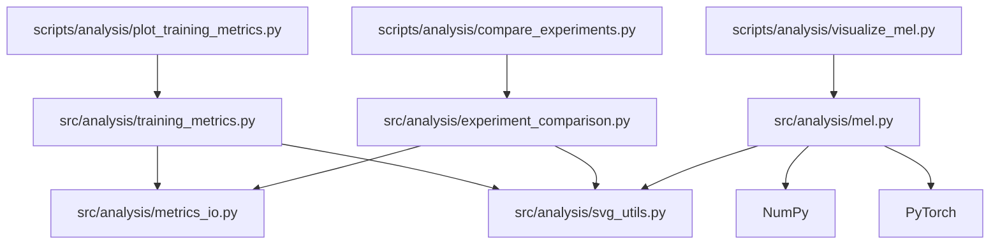

# 分析模块说明

## 1. 组织方式

分析代码分为两层：

- **`src/analysis/`：可复用的分析模块。** 负责读取数据、统计指标、生成图表和摘要，可从其他 Python 程序或 Notebook 导入。
- **`scripts/analysis/`：命令行入口。** 使用 `argparse` 解析参数，调用分析模块，打印输出路径。不再独立实现分析算法。

当前不使用 Hydra，也不依赖训练配置、模型实例或 Trainer。输入是已有的指标 CSV 或张量文件，执行分析不会启动训练或下载数据。

## 2. 文件与职责

### 可复用模块

| 文件                                                                    | 职责                                           | 主要接口                                                                                            |
| ----------------------------------------------------------------------- | ---------------------------------------------- | --------------------------------------------------------------------------------------------------- |
| [metrics_io.py](../../src/analysis/metrics_io.py)                       | 定位 CSV、读取记录、提取指标序列、计算统计     | `resolve_metrics_csv()`、`read_metrics()`、`metric_points()`、`summarize_metric()`、`load_metric()` |
| [svg_utils.py](../../src/analysis/svg_utils.py)                         | 直接生成 SVG，不依赖第三方绘图库               | `write_line_chart()`、`write_bar_chart()`、`write_heatmap()`                                        |
| [training_metrics.py](../../src/analysis/training_metrics.py)           | 单次训练的曲线与统计摘要                       | `analyze()`                                                                                         |
| [experiment_comparison.py](../../src/analysis/experiment_comparison.py) | 多次实验的统计表与最优指标柱状图               | `compare()`                                                                                         |
| [mel.py](../../src/analysis/mel.py)                                     | 读取张量、选择样本、整理维度、绘制热力图与统计 | `visualize()`                                                                                       |

### 命令行入口

| 文件                                                 | 对应分析模块                         | 职责                                |
| ---------------------------------------------------- | ------------------------------------ | ----------------------------------- |
| [plot_training_metrics.py](plot_training_metrics.py) | `src.analysis.training_metrics`      | 单次训练分析入口                    |
| [compare_experiments.py](compare_experiments.py)     | `src.analysis.experiment_comparison` | 解析多个 `名称=路径` 参数并执行对比 |
| [visualize_mel.py](visualize_mel.py)                 | `src.analysis.mel`                   | Mel 可视化入口                      |

此目录只保留三个命令行入口和本说明。共用工具仅在 `src/analysis/` 中维护，复用时直接从对应模块导入。

## 3. 依赖关系

下图中箭头表示“导入 / 调用”：



依赖方向是 **脚本 → 分析模块 → 共用工具**。`src/analysis/` 不反向导入 `scripts/analysis/`，因此复用时无需携带命令行脚本。

- 指标读取、训练分析、实验对比和 SVG 绘图仅依赖 Python 标准库。
- Mel 分析额外依赖 `numpy` 和 `torch`，读取张量时使用 CPU，不要求 GPU。
- `argparse` 和项目根目录的 `sys.path` 初始化只在脚本层使用。后者用于支持直接运行脚本。
- 复用模块时，项目根目录需要位于 Python 导入路径中。若迁入其他项目，应保留整个分析包及内部相对导入，并配置 NumPy / PyTorch（仅 Mel 任务需要）。

## 4. 命令行使用

以下命令在项目根目录执行；示例中的输入路径需替换为实际文件或目录。

### 单次训练分析

```bash
python scripts/analysis/plot_training_metrics.py /path/to/run \
  --metrics train/loss val/loss test/loss \
  --output-dir /path/to/output \
  --title "训练指标曲线"
```

- 输入可以是 CSV 文件或包含唯一 `metrics.csv` 的目录。
- 默认指标为 `train/loss`、`val/loss`、`test/loss`；没有有效数据的指标会被跳过，全部无效时报错。
- 不指定输出目录时，写入指标文件旁的 `analysis/`。
- 输出：`training_curves.svg`、`metrics_summary.json`。

### 多实验对比

```bash
python scripts/analysis/compare_experiments.py \
  --run B1=/path/to/run1 \
  --run B2=/path/to/run2 \
  --metric val/loss \
  --output-dir /path/to/comparison
```

- 至少指定两个实验，每个路径可以是 CSV 文件或运行目录。
- 默认比较 `val/loss`，默认输出到当前工作目录下的 `analysis_results/`。
- 输出：`experiment_comparison.csv`、`experiment_comparison.svg`。
- CSV 包含最优值、最终值、最优位置等统计，柱状图展示最优值。

### Mel 可视化

```bash
python scripts/analysis/visualize_mel.py /path/to/sample.pt \
  --key mel \
  --batch-index 0 \
  --max-frames 300 \
  --output-dir /path/to/mel_analysis
```

- 支持 `.pt`、`.pth`、`.npy`、`.npz`。
- 包含多个候选张量的字典或多个数组的 NPZ，需要通过 `--key` 选择。
- 三维输入使用 `--batch-index` 选择样本；可用 `--transpose` 交换两个维度。
- 不指定输出目录时，写入输入文件旁的 `analysis/`。
- 输出：`<输入文件名不含扩展名>_mel.svg`、`<输入文件名不含扩展名>_mel_stats.json`。
- 此工具读取已有张量，不负责将音频转换为 Mel，也不将 VCTK 内容特征或说话人向量自动转换为 Mel。

各入口均可使用 `--help` 查看参数。脚本支持从其他工作目录以绝对脚本路径启动，但相对输入路径仍以当前工作目录为基准。

## 5. Python 中复用

```python
from pathlib import Path

from src.analysis.training_metrics import analyze
from src.analysis.experiment_comparison import compare
from src.analysis.mel import visualize

chart_path, summary_path = analyze(
    input_path=Path("/path/to/run"),
    metrics=["train/loss", "val/loss"],
    output_dir=Path("/path/to/output"),
    title="训练指标曲线",
)

comparison_table, comparison_chart = compare(
    runs=[("B1", Path("/path/to/run1")), ("B2", Path("/path/to/run2"))],
    metric="val/loss",
    output_dir=Path("/path/to/comparison"),
)

mel_chart, mel_summary = visualize(
    input_path=Path("/path/to/sample.npy"),
    key=None,
    batch_index=0,
    transpose=False,
    max_frames=300,
    output_dir=Path("/path/to/mel_analysis"),
    title=None,
)
```

三个接口均返回两个输出文件的 `Path`，不会解析命令行或打印结果。函数参数没有默认值，调用时需显式传入；默认选项由脚本入口提供。

## 6. 当前行为与限制

- 指标横坐标优先使用有效的 `epoch`，其次使用 `step`，均无效时使用记录序号。同一位置的同一指标保留最后一个有效数值，然后按位置排序。
- 指标统计忽略空值、无法转换的值、NaN 和无穷值；“最终值”是排序后最后位置的值。
- 训练分析和实验对比通过指标名是否包含 `loss` 决定最优方向：包含时取最小值，否则取最大值。其他需要最小化的指标暂时不能通过命令行指定方向。
- Mel 在去除单例维度后选择样本、处理方向，并按 `max_frames` 均匀抽样。**当前 JSON 统计针对处理后的绘图矩阵，不一定代表完整输入。** 非有限值检查也发生在抽样之后。
- Mel 方向存在形状启发式推断，图表横轴是帧而非秒，纵轴是 Mel 通道而非 Hz。
- 输出目录自动创建；相同目录、相同输出文件名会覆盖原文件。重复分析需要保留历史结果时，请指定不同输出目录。
- PyTorch 文件使用 `weights_only=True` 读取，NumPy 文件使用 `allow_pickle=False`，不要为了读取不兼容文件而关闭这些限制。

## 7. 测试与维护

回归测试位于 [tests/analysis/test_analysis.py](../../tests/analysis/test_analysis.py)，包含指标统计、输出内容、Mel 抽样行为，以及三个脚本从外部工作目录运行 `--help` 的检查。

注意：当前测试仍导入已删除的两个兼容包装，需要移除这些导入及对应断言后才能正常收集测试。

在现有环境中可执行：

```bash
conda activate Lightning-Template
pytest tests/analysis/test_analysis.py
```

维护时遵循以下边界：

1. 分析算法、统计规则和绘图逻辑修改在 `src/analysis/` 完成。
2. 命令行参数、帮助信息和结果打印修改在 `scripts/analysis/` 完成。
3. 行为变化同步更新回归测试和本说明，不在脚本入口中复制业务代码。
