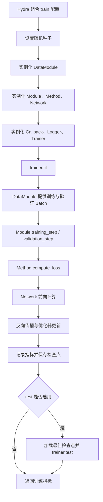
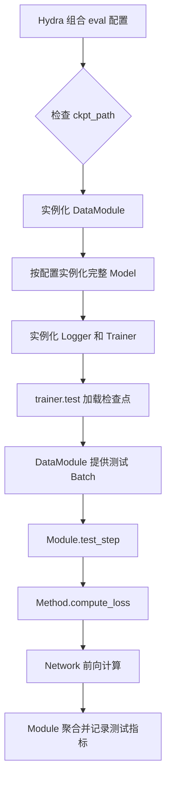

# `src/` 训练与评估流程

## 整体串联关系

```text
Hydra 配置
  ├── data      → DataModule
  ├── model     → Module → Method → Network / Component
  ├── trainer   → Lightning Trainer
  ├── callbacks → Checkpoint、EarlyStopping 等
  └── logger    → TensorBoard、WandB 等
```

职责关系：

```text
DataModule 产生规范 Batch
    ↓
Module 适配 Batch，并管理 Lightning 生命周期、指标和优化器
    ↓
Method 计算训练目标、损失、扰动和生成过程
    ↓
Network 执行神经网络前向计算
    ↓
Component 提供网络块、嵌入和条件编码等可复用单元
```

一个实验由 Data、Module、Method、Network、Trainer 和超参数共同组成，不要求一个实验对应一个 Module。只要 Batch 契约和训练生命周期相同，不同实验可以复用同一个 Module。

## Train 流程

入口：`src/train.py`



具体步骤：

1. Hydra 从 `configs/train.yaml` 组合 Data、Model、Trainer、Callback、Logger 和 Experiment 配置。
2. `train()` 设置随机种子，并通过 `_target_` 实例化 DataModule 和 Lightning Module。
3. Model 配置继续递归实例化 Module 内的 Method、Network 和 Component。
4. `trainer.fit()` 调用 DataModule 的 `setup()`、`train_dataloader()` 和 `val_dataloader()`。
5. Module 从 Batch 中提取规范输入，在 `model_step()` 中调用 `method.compute_loss()`。
6. Method 构造算法目标并调用 Network；Module 负责日志，Trainer 负责反向传播、优化器和调度器。
7. Callback 根据验证指标保存检查点，并可执行 EarlyStopping。
8. 当 `test: true` 时，训练结束后使用最佳检查点执行 `trainer.test()`；若不存在最佳检查点，则使用当前权重。

示例：

```bash
python src/train.py experiment=conditional_flow_matching_vctk
```

恢复训练时通过 `ckpt_path` 传入 Lightning 检查点。

## Eval 流程

入口：`src/eval.py`



具体步骤：

1. `eval.py` 要求提供 `ckpt_path`。
2. Hydra 根据 `configs/eval.yaml` 和命令行覆盖项实例化 DataModule、Module、Method 和 Network。
3. `trainer.test(..., ckpt_path=...)` 将检查点权重加载到当前配置构造的模型。
4. DataModule 提供测试 Batch，Module 的 `test_step()` 完成 Batch 适配和指标记录。
5. Module 调用 Method，Method 调用 Network，最终指标从 `trainer.callback_metrics` 返回。

示例：

```bash
python src/eval.py \
  data=vctk \
  model=conditional_flow_matching \
  ckpt_path=/path/to/best.ckpt
```

评估配置必须与检查点对应的 Module、Method、Network 和关键维度兼容。`eval.py` 不会仅根据检查点路径自动恢复原实验配置。

## Train 与 Eval 的主要区别

| 项目       | Train                        | Eval                          |
| ---------- | ---------------------------- | ----------------------------- |
| 入口       | `src/train.py`               | `src/eval.py`                 |
| 必需检查点 | 否                           | 是                            |
| 数据       | train、val，可选 test        | test                          |
| 梯度更新   | 是                           | 否                            |
| Callback   | 训练配置中实例化             | 当前入口不实例化训练 Callback |
| 权重       | 初始化、恢复训练或预训练权重 | 从 `ckpt_path` 加载           |
| 输出       | 训练、验证及可选测试指标     | 测试指标                      |

需要生成预测结果时，应使用 `trainer.predict()` 和 Module 的 `predict_step()`；当前 `eval.py` 默认只执行 `trainer.test()`。
